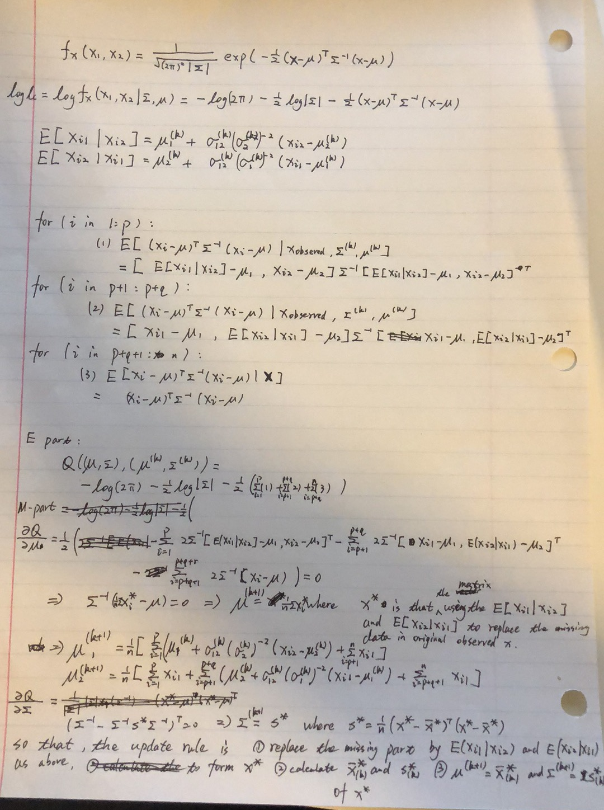

### Problem 1.

(a) 
$$
\begin{split}
l(\theta) & = x_1\log(2+\theta)+(x_2+x_3)\log(1-\theta)+x_4\log\theta+c\\
l'(\theta)& = \frac {x_1} {2+\theta}+\frac{x_2+x_3}{1-\theta}+\frac {x_4}{\theta} = 0
\end{split}
$$

plug $(125,21,20,33)$ in , and we can get 
$$
199\theta^2-10\theta-66=0
$$
by solving the binary equation above, we can get 

$$
\theta =\frac {10\pm\sqrt{100+4\times 199\times 66}}{2\times199}\approx0.6015713
$$

(b)

For the E step, we have,

$$
\begin{split}
Q(\theta,\theta^{(t)})&=E[l_c(\theta)|\mathbb x]\\
& = E[(x_{12}+x_4)\log\theta+(x_2+x_3)\log(1-\theta)|\mathbb x]\\
& = (E[x_{12}|\mathbb x]+x_4)\log\theta+(x_2+x_3)\log(1-\theta)\\
& = (x_1\frac {\theta^{(t)}}{2+\theta^{(t)}}+x_4)\log\theta+(x_2+x_3)\log(1-\theta)\\
\end{split}
$$

for the M step, we have,

$$
\begin{split}
Q(\theta,\theta^{(t)})& = (x_1\frac {\theta^{(t)}}{2+\theta^{(t)}}+x_4)\log\theta+(x_2+x_3)\log(1-\theta)\\
Q'_\theta(\theta,\theta^{(t)})&=(x_1\frac {\theta^{(t)}}{2+\theta^{(t)}}+x_4)\frac 1\theta-(x_2+x_3)\frac 1 {1-\theta} = 0\\
\Rightarrow\theta^{t+1}&=\frac {x_1\frac {\theta^{(t)}}{2+\theta^{(t)}}+x_4}{x_1\frac {\theta^{(t)}}{2+\theta^{(t)}}+x_4+x_2+x_3}
\end{split}
$$

```{r,echo = FALSE}
set.seed(123)
update = function(theta){
  (125*(theta/(2+theta))+33)/(125*(theta/(2+theta))+33+21+20)
}
theta =runif(1,0,100)
for (i in 1:1000){
  theta = update(theta)
}
theta
```
the number above is the E-M algorithm results.

(c) they are the same.

### Problem 2.



step 1. calculate the conditional expectation and replace the missing data with it

step 2. calculate the sample mean and sample variance

step 3. update the 5 unknown variables by sample mean and sample variance.

step 4. go to step 1 using the new variable given by step3, unless it converges.

details are in the Figure 1.


### Problem 3.

$$
\begin{split}
f(x)&\propto e^{-x},0<x<2\\
\int_0^2ce^{-x}dx&=1\\
-ce^{-x}|_0^2&=1\\
c(1-e^{-2})&=1\\
c&=\frac 1{1-e^{-2}}
\end{split}
$$
so that we have 
$$
f(x)=\frac {e^{2-x}}{e^{2}-1},0<x<2
$$
also we can get the cdf (for 0<x<2):
$$
F(x) = \int_0^xf(t)dt = \frac {e^{2}}{e^{2}-1}\int_0^xe^{-t}dt =\frac {1-e^{-x}}{1-e^{-2}}
$$
Inverse transformation 

$$
F^{-1}(x) = -\log(1-(1-e^{-2})x)
$$

so that sample u from unif(0,1) 5000 times and put it into the equation above to get x.

```{r,echo =FALSE}
f = function (u){
  -log(1-(1-exp(-2))*u)
}
u = runif(5000)
x = f(u)
plot(density(x),main = "using density() to make a plot")
hist(x,breaks = 50,main = "using hist() to make a plot")
```

### Problem 4.

(1)

$q(x)\le\alpha g_1(x)$ take $\alpha = sup\frac {q(x)}{g_1(x)} = 1$

step 1.
$g_1(x)=e^{-x}$ and we can get the inverse transformation that $G_1^{-1}(x) = -\log(1-x)$ and using the inverse transformation method, we generate a samples from unif(0,1) and plug in the function above (then we get a sample x from $g_1(x)$)and get another unif(0,1) sample u.

step 2.
if $u>\frac {q(x)} {g_1(x)}$ then return to step 1, otherwise keep x and go the step 3.

step 3.
if we have already generate 5000 random observations plot them, otherwise go to step 1.

```{r,echo=FALSE}
g_1 = function(x){
  -log(1-x)
}

g1 = function(x){
  exp(-x)
}

q = function(x){
  exp(-x)/(1+x^2)
}

list = c()
t1=0
for (i in 1:5000) {
  while (1) {
    t1 = t1+1
    x=g_1(runif(1))
    u=runif(1)
    if (u<(q(x)/g1(x))){break}
  }
  list = c(list,x)
}

plot(density(list),main = "density of g1",xlim=c(0,5))
```

now change to $g_2(x)=\frac 2 {\pi(1+x^2)}$, it is easy to get the inverse of the CDF of $g_2$, $G_2^{-1}(x) = \tan(\frac\pi2x)$

$\alpha = sup\frac {q(x)}{g_2(x)} = sup\frac {\pi e^{-x}} 2 = \frac \pi 2$

the steps are the same as the previous one.
  
```{r,echo=FALSE}
g_2 = function(x){
  tan(pi*x/2)
}

g2 = function(x){
  2/(pi*(1+x^2))
}

q = function(x){
  exp(-x)/(1+x^2)
}

t2=0
list = c()
for (i in 1:5000) {
  while (1) {
    t2 = t2+1
    x=g_2(runif(1))
    u=runif(1)
    if (u<(q(x)/g2(x))){break}
  }
  list = c(list,x)
}

plot(density(list),main = "density of g1",xlim=c(0,5))
```
both graph have some values greater than 5 which is not included.

(b)
Instead of using the system.time function (which is not useful since it is not stable as i tried), I use the acceptance ratio to roughly judge which one is better.

The acceptance ratio of $g_1$
```{r}
5000/t1
```

The acceptance ratio of $g_2$
```{r}
5000/t2
```
$g_1$ is faster than $g_2$ as the acceptance ratio of $g_1$ is greater than $g_2$

### Problem 5.

(a)

$$
\begin{split}
\int_0^{\infty}g(x)dx&=1\\
\int_0^\infty c(2x^{\theta-1}+x^{\theta-1/2})e^{-x}dx&=1\\
2c\int_0^\infty x^{\theta-1}e^{-x}dx+c\int_0^\infty x^{\theta-1/2}e^{-x}dx&=1\\
2c\Gamma(\theta)\int_0^\infty \frac 1 {\Gamma(\theta)}x^{\theta-1}e^{-x}dx+c\Gamma(\theta+\frac 1 2)\int_0^\infty \frac 1 {\Gamma(\theta+\frac 1 2)}x^{\theta+1/2-1}e^{-x}dx&=1\\
2c\Gamma(\theta)+c\Gamma(\theta+\frac 1 2)&=1\\
c&=\frac 1{2\Gamma(\theta)+\Gamma(\theta+\frac 1 2)}\\
\end{split}
$$

(b)

As shown in (a), I use the gamma distribution to let the integral parts to become 1. it can be also shown as below.

$$
g(x) = c_1 \frac 1 {\Gamma(\theta)}x^{\theta-1}e^{-x}+c_2 \frac 1 {\Gamma(\theta+\frac 1 2)}x^{\theta+1/2-1}e^{-x}\\
$$

It is a mixture of Gamma($\theta$,1) and Gamma($\theta+\frac 1 2$,1)  

where the weight $c_1=\frac {2\Gamma(\theta)}{2\Gamma(\theta)+\Gamma(\theta+\frac 1 2)}$,$c_2=\frac {\Gamma(\theta+\frac 1 2)}{2\Gamma(\theta)+\Gamma(\theta+\frac 1 2)}$

(c)

we can make a two steps sampling.

step 1. Get U from Uniform(0,1)
step 2. If $U>c_1=\frac {2\Gamma(\theta)}{2\Gamma(\theta)+\Gamma(\theta+\frac 1 2)}$ get X from Gamma($\theta+\frac 1 2$,1), otherwise get X from Gamma($\theta$,1).

proof:

let $h(x)$ be the pdf of x from the above procedure
$$
\begin{split}
h(x)&=P(U>c_1)f(x|U>c_1)+P(U\le c_1)f(x|U\le c_1)\\&=c_2 \frac 1 {\Gamma(\theta+\frac 1 2)}x^{\theta+1/2-1}e^{-x}+c_1 \frac 1 {\Gamma(\theta)}x^{\theta-1}e^{-x}\\
&=g(x)
\end{split}
$$

(d)

$$
\begin{split}
\frac{q(x)}{g(x)}&=\frac{\sqrt{4+x}x^{\theta-1}e^{-x}}{c(2x^{\theta-1}+x^{\theta-1/2})e^{-x}}\\
&=\frac{\sqrt{4+x}}{c(2+x^{1/2})}\\
&=(2\Gamma(\theta)+\Gamma(\theta+\frac 1 2))\frac{\sqrt{4+x}}{(2+x^{1/2})}\\
\end{split}
$$

so that

$\alpha = \sup\frac{q(x)}{g(x)}=2\Gamma(\theta)+\Gamma(\theta+\frac 1 2)$

for each $\theta$

step 1. sample $X\sim g(x)$, $U\sim Unif(0,1)$

step 2. if $u>\frac {q(x)}{\alpha g(x)}$ then go to step 1. Otherwise return X.

step 3. repeat step 1 and 2 until got enough samples.

```{r,echo=FALSE}
q = function (x){
  sqrt(4+x)*x^(i-1)*exp(-x)
}

g = function (x){
  (2*x^(i-1)+x^(i-1/2))*exp(-x)#*1/alpha
}

theta = c(0.5,1,1.5)
for (i in theta){
  alpha = 2*gamma(i)+gamma(i+1/2)
  c1 = 2*gamma(i)/alpha
  list=c()
  for (j in 1:5000){
    while (1){
      #get x
      u = runif(1)
      if (u>c1){x = rgamma(1,i,1)}
      else {x = rgamma(1,i+1/2,1)}
      u = runif(1)
      if (u<(q(x)/g(x))){break}#alpha/alpha=1
    }
    list = c(list,x)
  }
  plot(density(list)$x,density(list)$y,xlab="",ylab = "Density",ylim=c(0,1),xlim=c(0,5),main="density plot of f(x)",type = "l")
  par(new=TRUE,no.readonly = FALSE)
}

```


### problem 6.

$$
f(x,y)\propto x^\alpha y,x>0,y>0,x^2+y^2\le1
$$
as we can see $\int x^\alpha dx=\frac 1 {1+\alpha}x^{\alpha+1}<0$ if $\alpha\le-1$, so that $\alpha>-1$.

$$
1=\int_0^1\int_0^{\sqrt{1-x^2}}cx^\alpha ydydx=\frac c 2\int_0^1x^\alpha(1-x^2)dx =\frac c {(\alpha+1)(\alpha+3)}
$$
so that $c = (\alpha+1)(\alpha+3)$

$$
f(x,y)= (\alpha+1)(\alpha+3)x^\alpha y,x>0,y>0,x^2+y^2\le1
$$


as the density function can be factorized into two part $x^\alpha$ and $y$. x and y are independent. we can sample them separately and then we use the rejection algorithm to meet the constrains.

let take an sample $x\sim beta(\alpha+1,1)$ and $y\sim beta(2,1)$, then the joint distribution will be 
$$
\begin{split}
f'(x,y)&=\frac{x^{\alpha+1-1}(1-x)^{1-1}}{B(\alpha+1,1)}\frac{y^{2-1}(1-y)^{1-1}}{B(2,1)}\\
&=\frac 1 {B(\alpha+1,1)B(2,1)}x^\alpha y\\
&=2(\alpha+1)x^\alpha y \propto x^\alpha y
\end{split}
$$
It shows that the sampling is valid. We can use the conditional distribution version of rejection algorithm to modify the constant part of the density.

In addition, $\{(x,y):x>0,y>0,x^2+y^2\le1\}$ is a subset of $\{(x,y):0<x\le1,0<y\le1\}$

We can do basic rejection algorithm below.

step 1. sample $x\sim beta(\alpha+1,1)$ and $y\sim beta(2,1)$

step 2. if $x^2+y^2>1$ , go to step 1. Otherwise, return (x,y).